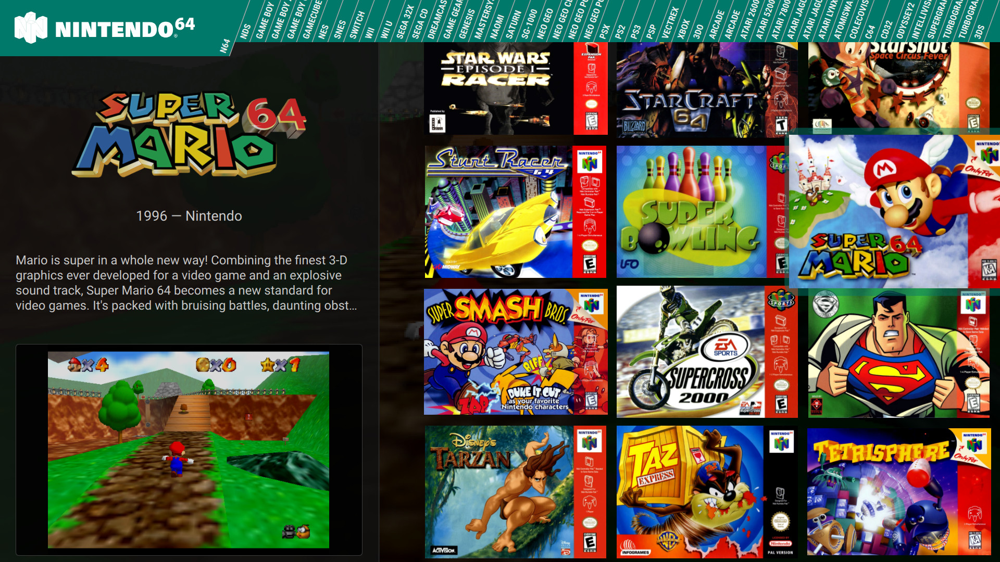

# Grid theme for Pegasus

The default theme of the [Pegasus](http://pegasus-frontend.org) frontend, modified.
Changed: 
* after closing a game grid scrolls to show game instead of returning to top
* RB and LB repeat for changing platforms, also RT and LT repeat for scrolling grid up/down
* changed grid to show 3 columns, to change back just uncomment lines 92 and 93 in GameGrid.qml
* color changes, red to green
* changed top platform bar to show 49 systems, I know 49 is very specific, but I wasn't trying to make it scale to any number of platforms, I just wanted 49 because that's how many I had at the time, should be easy enough to change for any number to look perfect, but you'll have to diff the files, I don't have those changes in a commit
* changed game highlight box to have rounded corners and transparent color
* added platform logo svgs for some systems that were missing, example atomiswave

Notes:  
I didn't like some of the labels for platforms in top bar (GB for GameBoy for instance), I added a property so you can customize it. for example add this to your metadata file under collection
`x-shortname_display: Game Boy`
Now it will show Game Boy instead of the shortname GB, you could just change the shortname, but you would also have to change the name of the logo image to the new shortname or the logo won't show, I didn't like that so I added the optional `x-shortname_display` 
I wish I could say you can reference commits to see the changes for each of these, but I didn't add to github until all the changes were made. You'll have to diff the files with the original to see what changes there are.
None of these changes have been tested in Windows, only Linux, they should work, but I haven't tested them

## Installation

Original:
This theme comes preinstalled with the official releases of Pegasus. If you wish to install a copy of it manually, just [download](https://github.com/mmatyas/pegasus-theme-9999999-in-1/archive/master.zip) and extract it to your [theme directory](http://pegasus-frontend.org/docs/user-guide/installing-themes). You can then select the theme in the settings menu of Pegasus.

